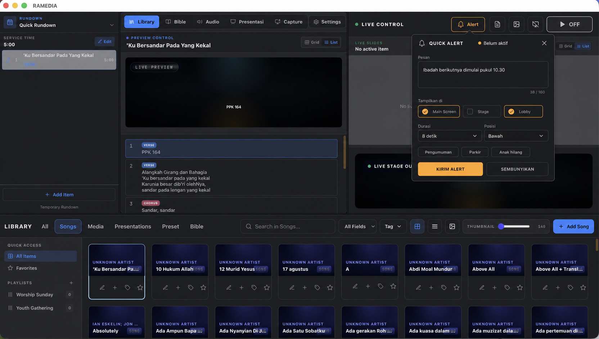
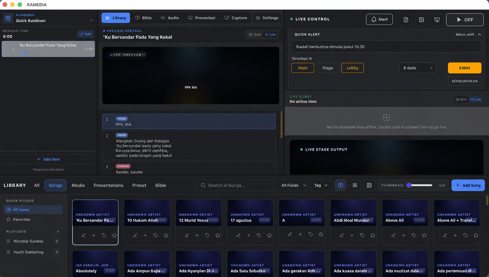
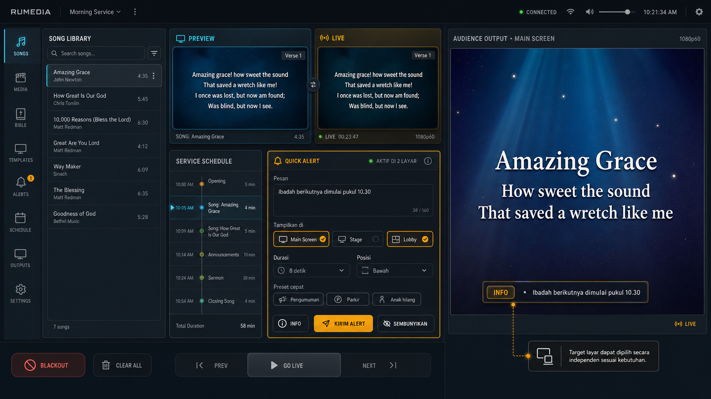

# RAMEDIA Quick Alert Center

> Status: MVP popup Quick Alert telah diimplementasikan pada controller dan jalur output.

## Kondisi Sebelum Implementasi

Sebelum MVP ini, RAMEDIA sudah memiliki alert output sederhana tetapi belum memiliki alur kirim alert manual.

- `Toast` hanya memberi feedback di layar operator.
- Setiap output memiliki `alertSettings` sendiri.
- Alert output sebelumnya hanya mengambil teks dari `slide.notes` ketika slide baru tampil.
- Pengaturan yang tersedia: aktif/nonaktif, posisi atas/bawah, durasi, warna latar, dan warna teks.
- Alert sudah dapat diatur berbeda per output, tetapi operator belum bisa memilih beberapa target lalu mengirim pesan secara langsung.

## Konsep Utama

Tambahkan **Quick Alert Center** sebagai overlay independen dari slide. Operator dapat mengetik pesan, memilih target layar, melihat preview, lalu menampilkan atau menyembunyikannya tanpa mengganti konten yang sedang live.

Contoh penggunaan:

- informasi waktu ibadah berikutnya;
- arahan parkir atau perpindahan ruangan;
- panggilan untuk orang tua;
- informasi teknis singkat untuk worship leader atau stage;
- pesan darurat yang harus segera tampil.

## Alur Operator

1. Buka panel `Alerts` atau quick dock.
2. Tulis pesan atau pilih preset cepat.
3. Pilih satu atau beberapa target: Main Screen, Stage, Lobby, Browser Output, atau NDI.
4. Atur jenis, posisi, dan durasi.
5. Periksa preview pada target aktif.
6. Tekan `Kirim Alert`.
7. Alert hilang otomatis atau dapat dihentikan lewat `Sembunyikan`.

## Kontrol MVP

- Pesan maksimal 160 karakter dengan penghitung karakter.
- Target layar multi-select.
- Jenis: Info, Peringatan, Darurat, dan Netral.
- Posisi: atas atau bawah, mengikuti safe area output.
- Durasi: 5, 8, 15, 30 detik, atau sampai disembunyikan.
- Preset pesan yang dapat digunakan ulang.
- Tombol kirim, kirim ulang, dan sembunyikan.
- Indikator `Aktif di N layar` serta sisa waktu.
- Hanya satu alert terlihat per layar; alert berikutnya masuk antrean agar pesan tidak bertumpuk.

## Perilaku Output

- Alert adalah layer sistem di atas konten slide, bukan bagian dari slide.
- Pergantian slide tidak menutup atau memicu ulang alert manual.
- `Clear` tetap dapat menampilkan alert agar pengumuman dapat berdiri sendiri.
- `Blackout` dan `Logo` menyembunyikan alert.
- Mode NDI `broadcast-lyrics` tidak menampilkan alert kecuali target tersebut diaktifkan secara eksplisit pada fase lanjutan.
- Ukuran teks responsif, maksimum dua baris, kontras tinggi, dan tidak menutupi area lirik utama.
- Animasi masuk/keluar menggunakan opacity dan transform singkat; durasi sekitar 180–240 ms.

## Model Data dan Sinkronisasi

```ts
interface OutputAlertMessage {
  id: string;
  text: string;
  tone: 'info' | 'warning' | 'emergency' | 'neutral';
  targetOutputIds: string[];
  position: 'top' | 'bottom';
  durationMs: number | null;
  createdAt: number;
  expiresAt: number | null;
}
```

Event sinkronisasi yang disarankan:

- `ALERT_SHOW`
- `ALERT_HIDE`
- `ALERT_EXPIRE`

Mekanisme `slide.notes` yang sudah ada tetap dipertahankan sebagai sumber otomatis opsional, tetapi dirender melalui layer alert yang sama agar perilakunya konsisten.

## Tahapan Implementasi

### MVP

- [x] store alert global;
- [x] composer manual berbentuk anchored popup;
- [x] target output multi-select;
- [x] renderer alert bersama;
- [x] show/hide dan auto-expire;
- [x] preset lokal;
- [x] sinkronisasi Electron, browser output, NDI, dan stage route;

### Fase Lanjutan

- antrean dan riwayat alert;
- preset tersimpan di database;
- penjadwalan alert;
- trigger dari Remote Control;
- hak akses operator;
- ticker berjalan untuk pesan panjang;
- audit log pengirim dan waktu tampil.

## Mockup

### Penempatan yang Direkomendasikan

Tombol `Alert` berada di header **Live Control**. Saat diklik, composer tampil sebagai popup di tengah viewport. Popup mengambang di atas aplikasi sehingga tidak mendorong, mengecilkan, atau mengubah layout panel yang sudah ada.

Popup ditutup melalui tombol `X`, klik di luar, atau tombol `Esc`. Backdrop menggunakan warna theme dengan opacity ringan agar konteks Live Control tetap terlihat.



### Eksplorasi Panel Terbuka



### Eksplorasi Awal Terpisah


