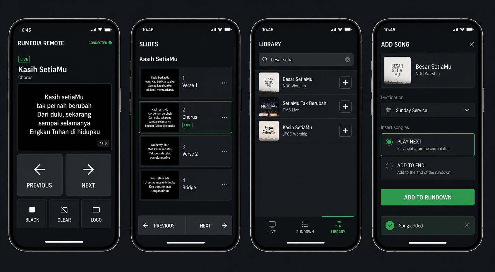

# RAMEDIA Web Remote — Concept and Implementation Plan

## 1. Product Goal

RAMEDIA Web Remote is a mobile companion for the Electron controller. It lets an authorized operator control the current presentation from a phone or tablet on the same local network without duplicating the full desktop interface.

The first release should support two jobs:

1. Operate the live presentation safely: previous/next slide, direct slide selection, Black, Clear, and Logo.
2. Search the song library and add a song to the active rundown without returning to the controller computer.

The remote is not a browser output. It is a separate authenticated client with its own pairing code, permissions, session lifecycle, and API routes.

## 2. UX Principles

- Live safety first: the current program state must always be visible.
- One-hand operation: Previous and Next use the largest touch targets on the Live screen.
- Destructive controls are separated from navigation and show their active state clearly.
- Adding a song never sends it live automatically.
- Network loss is visible immediately and disables commands until the state is synchronized again.
- Every mutation returns an acknowledgement and a fresh state revision.
- The phone mirrors authoritative desktop state; it does not keep its own independent rundown.

## 3. Information Architecture

### Live

- Connection and operator status
- Current item and slide label
- Low-bandwidth program thumbnail or current-slide renderer
- Previous / Next
- Black / Clear / Logo
- Open the full slide list

### Rundown

- Active schedule name
- Ordered schedule items
- Current item and current slide markers
- Select an item for preview
- Start the selected item only after an explicit `Go Live` action
- Reordering and deleting are deferred until after the first release

### Library

- Debounced song search
- Song title, author, and optional thumbnail
- Open song details
- Add to rundown
- Choose `Play Next` or `Add to End`
- Confirmation containing the final rundown position

### Connection

- Pairing screen and QR entry point
- Device/session name
- Permission summary
- Reconnect, revoke, and session expiry states

## 4. Primary Flows

### Pair a Remote

1. Desktop opens Settings > Remote Control.
2. Desktop creates a short-lived QR code and six-character pairing code.
3. Phone opens `http://<controller-ip>:17884/remote` and scans or enters the code.
4. Desktop shows the requested device and asks the operator to approve it.
5. Server issues a revocable session token with a selected role.
6. Phone loads the state snapshot and opens the Live screen.

### Move Between Slides

1. Remote receives the authoritative live snapshot and revision number.
2. Operator taps Previous, Next, or a slide thumbnail.
3. Remote sends a command with a unique command ID and the last known revision.
4. Controller resolves the command against its current live slide list.
5. Controller executes `goLive`, broadcasts the updated state, and acknowledges the command.
6. Remote updates only from the server response/event, avoiding optimistic slide drift.

### Add a Song from Library

1. Operator searches by title, lyrics, or author.
2. Remote requests paginated results from the Electron database.
3. Operator selects a song and chooses `Play Next` or `Add to End`.
4. Server validates the active schedule and operator permission.
5. Schedule service creates the schedule item and broadcasts a rundown update.
6. Remote displays `Song added` with an Undo option during a short safe window.

## 5. Roles and Permissions

| Role | Live navigation | Black/Clear/Logo | Add songs | Change rundown | Settings |
| --- | --- | --- | --- | --- | --- |
| Presenter | Yes | Optional | No | No | No |
| Worship Leader | Yes | No | Yes | Add only | No |
| Operator | Yes | Yes | Yes | Yes | No |
| Viewer | No | No | No | No | No |

Default pairing should use `Presenter`. Elevated roles must be selected and approved on the desktop.

## 6. Proposed Architecture

```text
Mobile browser
  | HTTPS/HTTP on trusted LAN
  | REST commands + SSE state/events
  v
Electron main process :17884
  | validates session, role, command id, and state revision
  | forwards remote command through IPC
  v
Controller renderer
  | owns active item, live slide list, preview focus, and goLive behavior
  | updates Zustand stores and database services
  v
Electron main process
  | publishes authoritative snapshot and command acknowledgement
  v
Remote SSE connection
```

The existing browser-output server and SSE utilities can be reused, but remote routes and credentials must remain separate from browser-output pairing.

### Why the Controller Renderer Must Participate

The Electron main process currently knows the rendered presentation state, but next/previous resolution depends on the controller's active item and `liveSlides`. Remote commands should therefore enter the controller renderer through IPC instead of manipulating `presentationState` directly in the main process.

## 7. Proposed Routes

### Pairing and Session

- `POST /api/remote/pair/request`
- `POST /api/remote/pair/approve` via Electron IPC from desktop
- `POST /api/remote/pair/exchange`
- `POST /api/remote/session/revoke`
- `GET /api/remote/session`

### State and Commands

- `GET /api/remote/state`
- `GET /api/remote/events` using SSE
- `POST /api/remote/commands/next-slide`
- `POST /api/remote/commands/previous-slide`
- `POST /api/remote/commands/go-to-slide`
- `POST /api/remote/commands/toggle-black`
- `POST /api/remote/commands/toggle-clear`
- `POST /api/remote/commands/toggle-logo`

### Rundown and Library

- `GET /api/remote/rundown`
- `GET /api/remote/library/songs?q=&page=&limit=`
- `GET /api/remote/library/songs/:songId`
- `POST /api/remote/rundown/items`
- `DELETE /api/remote/rundown/items/:itemId` deferred or Operator-only

Example add-song payload:

```json
{
  "songId": "song-id",
  "scheduleId": "active-schedule-id",
  "position": "after-current",
  "commandId": "client-generated-uuid",
  "expectedRevision": 184
}
```

## 8. Remote Snapshot

The remote snapshot should be intentionally smaller than the full presentation payload:

```ts
interface RemoteSnapshot {
  revision: number;
  connection: { serverName: string; role: RemoteRole };
  activeSchedule: { id: string; name: string } | null;
  currentItem: { id: string; title: string; type: string } | null;
  slides: Array<{ id: string; label: string; content: string }>;
  currentSlideId: string | null;
  isBlack: boolean;
  isClear: boolean;
  isLogo: boolean;
  can: RemotePermissions;
}
```

Media paths, database records, and edit-layer data should not be exposed unless needed by a remote feature.

## 9. Security and Reliability

- Bind to the LAN as today, but never authorize control from a browser-output pairing code.
- Use a random high-entropy session token stored hashed in the database.
- Make pairing codes short-lived and single-use.
- Require desktop approval for new devices and elevated roles.
- Store tokens in secure, same-origin cookies where practical; never put the session token in the URL.
- Apply rate limits to pairing, search, and mutation endpoints.
- Validate every request body and permission in the Electron main process.
- Add command IDs for idempotency so reconnect/retry cannot add the same song twice.
- Add monotonic revisions to detect stale commands.
- Show `Reconnecting` after missed heartbeat and disable command buttons while disconnected.
- Provide a desktop list of paired devices with `Revoke` and `Revoke all`.
- Local HTTP is acceptable for an initial trusted-LAN build, but production discovery should warn users about untrusted Wi-Fi and support local TLS when feasible.

## 10. Implementation Phases

### Phase 0 — Contract and State Extraction

- Define remote roles, permissions, snapshot, commands, errors, and revision semantics.
- Extract next/previous/direct-slide behavior from the keyboard handler into reusable controller actions.
- Add automated tests for navigation boundaries and duplicate command IDs.

Exit criterion: local controller actions and hotkeys use the same tested command functions.

### Phase 1 — Read-only Remote Shell

- Add `/remote` and `/remote/pair` React routes.
- Add dedicated remote session storage and pairing APIs.
- Publish current schedule, item, slides, and live flags over remote SSE.
- Add Remote Control settings for server URL, QR code, pending approval, and revoke.

Exit criterion: an approved phone stays synchronized with desktop state and cannot mutate it.

### Phase 2 — Live Controls

- Add Previous, Next, direct slide selection, Black, Clear, and Logo commands.
- Forward commands main process -> controller renderer -> shared presentation actions.
- Add command acknowledgement, state revisions, reconnect lockout, and permission checks.

Exit criterion: two paired phones and the desktop remain consistent through navigation and reconnect tests.

### Phase 3 — Library and Add to Rundown

- Add paginated song search backed by `songService`.
- Add song details and slide-count preview.
- Add schedule mutation for `after-current` and `end` positions.
- Broadcast updated rundown and show confirmation/Undo.
- Add database and API tests for duplicates, missing schedules, and stale revisions.

Exit criterion: an authorized phone can find a song and add it exactly once at the selected location.

### Phase 4 — Operational Hardening

- Add audit log for device, command, result, and timestamp.
- Add rate limiting and security review.
- Test iOS Safari, Android Chrome, sleep/wake, Wi-Fi changes, and port fallback.
- Add optional Bonjour/mDNS discovery and installable PWA metadata.

Exit criterion: remote passes a full service rehearsal with network interruption and recovery.

## 11. Suggested Delivery Order

1. Pairing + read-only state.
2. Next/Previous + direct slide selection.
3. Black/Clear/Logo.
4. Library search.
5. Add song to rundown.
6. Advanced rundown editing and media/Bible search in later releases.

This order proves the safety-critical control path before adding database mutations.

## 12. Acceptance Checklist for MVP

- Remote works from another device on the same Wi-Fi.
- Pairing requires explicit desktop approval.
- Browser-output codes cannot call remote APIs.
- Live screen shows current item, current slide, and connection state.
- Previous/Next cannot move beyond the available slide list.
- Direct slide selection updates all outputs once.
- Black/Clear/Logo states are mutually consistent with desktop.
- Search returns relevant songs without freezing the controller.
- Add song supports `Play Next` and `Add to End`.
- Retried requests never add duplicate schedule items.
- Remote disables mutations when disconnected or unauthorized.
- Desktop can revoke a remote immediately.

## 13. Mockup



